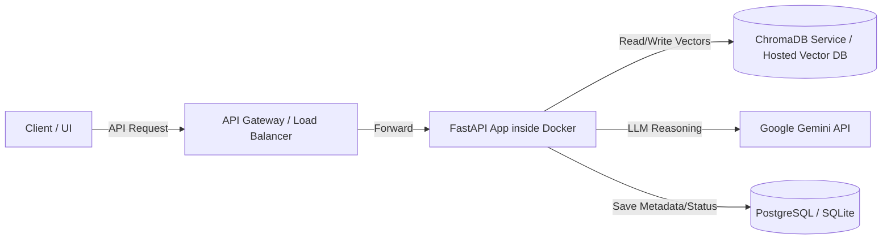

# CPIS Project Handover & Technical Reference Guide

Welcome to the **Career Pipeline Intelligence System (CPIS)**. This document serves as a complete technical reference and handover guide, prepared specifically for another AI assistant (like **Claude**) or engineer to pick up development seamlessly.

---

## 1. Project Overview & Objectives
CPIS is an intelligent, multi-agent system designed to automate the ingestion, parsing, classification, and analysis of career documents (e.g., resumes, job descriptions). The system reads raw documents, extracts structured data, evaluates skills, matches candidates to target jobs, and reports results.

---

## 2. Engineering Decisions: Why Custom Python/LangGraph over "Buzz" Tools (like n8n)

When building professional, enterprise-grade AI solutions, architectural decisions must favor robustness, debuggability, and flexibility over visual convenience. Here is the rationale for avoiding visual workflow tools like n8n:

| Feature | Custom Python & LangGraph (Our Choice) | Visual Workflow Tools (e.g., n8n) |
| :--- | :--- | :--- |
| **State & Cyclic Loops** | Native support for complex state management, cycles (e.g., self-correction loops, human-in-the-loop approvals), and state updates via Reducers. | Primarily built for linear DAGs; complex loops and state transitions become messy and hard to maintain. |
| **Testability & CI/CD** | Full unit, integration, and evaluation testing suite using standard tools (`pytest`, `deepeval`). Easily runs in github workflows or Jenkins. | Hard to unit-test visual nodes; lacks standard software engineering CI/CD and regression testing patterns. |
| **Granular Debugging** | Step-through debugging, custom stack traces, exceptions, and logging framework at any line of code. | Limited debugging visibility; errors are hard to trace inside nested node configurations. |
| **No Vendor/UI Lock-in** | Decoupled codebase packaged as a standard FastAPI app. Can be hosted anywhere without licensing limits or proprietary execution engines. | Tied to the platform's UI/licensing rules, execution models, and scaling limitations. |
| **Token Optimization** | Custom regex parser strips trailing spaces, non-printable characters, and redundant newlines *before* text hits LLMs, saving token costs. | Harder to implement custom low-level byte-level cleanup or regex pipelines dynamically. |

### The Agentic Architecture: LangGraph
CPIS uses **LangGraph** (under the LangChain ecosystem) to construct its agentic layers.
*   **Stateful Agentic Loops**: In LangGraph, the agent is represented as a graph where nodes are functions (or LLM prompts) and edges are transitions (conditional routing).
*   **Cyclic Workflows**: Unlike standard LangChain chains, LangGraph allows cycles. This is critical for tasks like **"Self-Correction Resume Parsing"** (e.g., parsing a document -> checking if the JSON matches the schema -> if invalid, looping back to the parser with details of the validation error).
*   **Immutable State**: The state is passed from node to node, ensuring thread safety and predictability.

---

## 3. Current Directory Structure & Progress (End of Phase 1)

Phase 1 focused on building a solid foundation (logging, configuration, exception framework) and a robust **Document Ingestion Layer**.

```
agentic-ai/
├── .gitignore
├── requirements.txt
├── logs/
│   └── cpis.log                  # Rolling application logs
├── src/
│   ├── core/
│   │   ├── config/
│   │   │   └── config.py         # Pydantic v2 Immutable Settings
│   │   ├── exceptions/
│   │   │   └── exceptions.py     # Custom exceptions (CPISException, etc.)
│   │   └── logger/
│   │       └── logger.py         # Console & File log config
│   ├── ingestion/
│   │   ├── loaders/
│   │   │   └── pdf_loader.py     # Binary parsing, hash verification, metadata collection
│   │   ├── parsers/
│   │   │   └── document_parser.py# Regex-based space and char sanitization
│   │   └── validators/
│   │       └── file_validator.py # Header byte validation (%PDF), size & extension limits
│   ├── models/
│   │   └── schemas/
│   │       └── schemas.py        # Immutable Pydantic models for Documents
│   └── tests/
│       ├── test_config.py        # Settings overrides and exception tests
│       ├── test_document_parser.py# Sanitization edge cases
│       ├── test_file_validator.py# Extension, empty, and magic-bytes checks
│       └── test_pdf_loader.py    # Mock tests for encryption and loading
```

### Technical Detail of Phase 1 Modules:
1.  **Config (`config.py`)**: Uses Pydantic v2 `ConfigDict(frozen=True)` to parse environment variables from `.env`. Accessible via a thread-safe cached `get_settings()` helper.
2.  **Validators (`file_validator.py`)**: Before opening files, verifies that:
    *   File exists and is not a directory.
    *   File size does not exceed `FILE_UPLOAD_MAX_SIZE_MB`.
    *   Extension is `.pdf`.
    *   First 4 bytes of the binary header match `%PDF` (preventing renamed scripts from executing).
3.  **Loaders (`pdf_loader.py`)**: Reads the PDF, extracts text using `pypdf`, counts pages, and computes a **SHA-256 hash** of the file to prevent duplicate processing.
4.  **Parsers (`document_parser.py`)**: Cleans control characters, condenses spaces/tabs, trims surrounding whitespace, and caps sequential blank newlines to two (maximizing context-window density).
5.  **Data Transfer Objects (`schemas.py`)**: Declares `DocumentMetadata` and `Document` schemas as frozen (immutable) Pydantic models.

---

## 4. Current Test Suite Status
All components are fully covered by unit tests located in `src/tests/`. The tests verify success paths and ensure the application raises custom exceptions (`ConfigException`, `IngestionException`, `ValidationException`) during failure modes.

To run the tests:
```powershell
# Activate venv
.\venv\Scripts\activate

# Run pytest on tests folder
python -m pytest src/tests/
```

---

## 5. Next Steps: Phase 2 Plan (RAG & Storage Layer)

The next steps for developing the project focus on persisting parsed text into a searchable vector database and building the LangGraph state machine.

### Task 1: Vector Database Integration (`chromadb`)
*   Implement `BaseVectorStore` abstract class to wrap vector database operations.
*   Implement `ChromaVectorStore` subclass pointing to settings' `VECTOR_DB_PATH`.
*   Integrate `sentence-transformers` to generate embeddings locally, or hook up Google Gemini embeddings via `google-generativeai`.
*   Store parsed `Document` text segments alongside their SHA-256 hash and metadata.

### Task 2: Chunking Strategy
*   Implement a semantic or recursive-character chunker inside `src/ingestion/parsers/` to split documents into ~500-1000 character pieces with overlapping margins, ensuring text matches keep context.

### Task 3: LangGraph State Machine Definition
*   Define the Graph State. E.g.:
    ```python
    from typing import Annotated, TypedDict, List
    from langgraph.graph.message import add_messages

    class AgentState(TypedDict):
        messages: Annotated[List[dict], add_messages]
        document_id: str
        extracted_data: dict
        validation_errors: List[str]
    ```
*   Create Nodes:
    *   `ExtractResumeNode`: Feeds parsed resume text to Gemini API to pull structured JSON fields (name, email, education, experience, skills).
    *   `ValidateDataNode`: Check if required fields exist; if validation fails, direct control back to a correction prompt with instructions.
    *   `MatchJobNode`: Queries ChromaDB for matching jobs or profiles, evaluating fit scoring.

---

## 6. Hosting & Deployment Strategy

To host this project in production, we recommend a lightweight, scalable, and portable cloud structure.



### Core Hosting Recommendations:
1.  **FastAPI Application Hosting**:
    *   **Google Cloud Run (Recommended)** or **AWS ECS Fargate**: Package the application inside a Docker container. Deploy as a serverless container. Cloud Run scales down to zero when idle, making it highly cost-efficient during dev/staging, and automatically handles scaling.
    *   **Docker Setup**: Build a multi-stage Dockerfile based on `python:3.11-slim` to keep image size small.
2.  **Database Strategy**:
    *   **Vector DB (ChromaDB)**: In development, run Chroma in-memory/on-disk. In production, run Chroma as a separate container service, or swap it for a serverless cloud vector store (e.g., Pinecone, Weaviate, or pgvector on RDS/Cloud SQL) to avoid managing vector file locks.
    *   **Relational DB (PostgreSQL / SQLite)**: For managing job pipeline state, logs, and OAuth Google API credentials (we see `google-auth` in `requirements.txt` for integration with Google Sheets).
3.  **Environment Configuration**:
    *   Secrets (like `GEMINI_API_KEY`, DB passwords) should be injected via cloud environment managers (e.g., AWS Secrets Manager, GCP Secret Manager) instead of hardcoding `.env` files.
