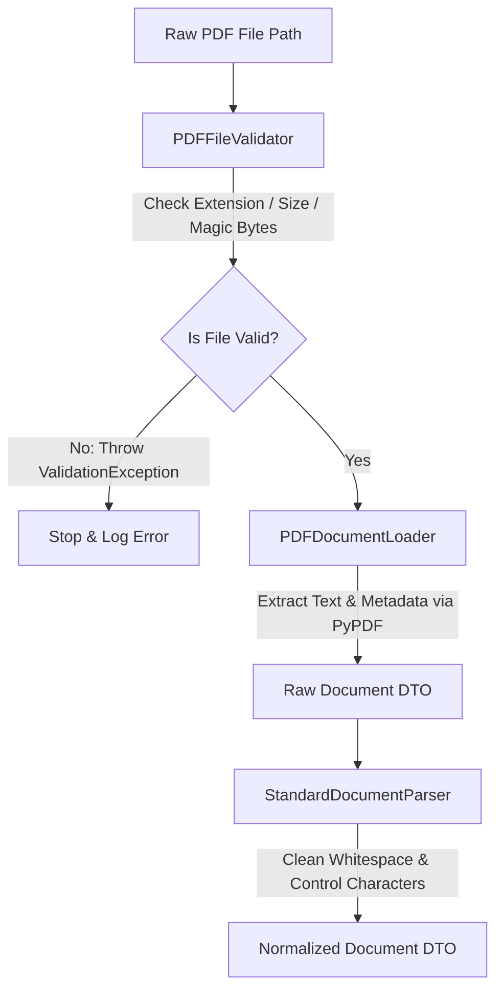

# CPIS Study Guide: Phase 1 — Document Ingestion Layer

Welcome to your study guide for Phase 1 of the **Career Pipeline Intelligence System (CPIS)**. This document breaks down the "Why" and "How" of everything we have built so far, structured to help you ace your system design and coding interviews.

---

## 1. System Architecture Diagram (Phase 1)

Here is how data flows during the ingestion stage:



---

## 2. Core Python Concepts & Design Patterns

### A. Single Responsibility Principle (SRP)
*   **What it is**: A class should have one, and only one, reason to change.
*   **How we used it**:
    *   `PDFFileValidator` has only **one** job: Check if the file is safe and valid. It doesn't read the file's content.
    *   `PDFDocumentLoader` has only **one** job: Open the file and extract pages. It doesn't clean the text.
    *   `StandardDocumentParser` has only **one** job: Take the text and sanitize/format it.

### B. Open-Closed Principle (OCP)
*   **What it is**: Software entities (classes, modules) should be **open for extension** but **closed for modification**.
*   **How we used it**: We defined abstract base classes (interfaces) using Python's `abc.ABC` module:
    ```python
    from abc import ABC, abstractmethod

    class BaseDocumentLoader(ABC):
        @abstractmethod
        def load(self, file_path: Path) -> Document:
            pass
    ```
    If we want to support Word documents (`.docx`) tomorrow, we **don't modify** our existing code. Instead, we **extend** the system by writing a new class:
    ```python
    class DocxDocumentLoader(BaseDocumentLoader):
        def load(self, file_path: Path) -> Document:
            # Word extraction logic here
            pass
    ```

### C. Dependency Injection (DI)
*   **What it is**: Passing dependent objects into a class rather than letting the class instantiate them internally.
*   **How we used it**: In `PDFDocumentLoader`, we inject the validator:
    ```python
    def __init__(self, validator: BaseFileValidator = None) -> None:
        self.validator = validator or PDFFileValidator()
    ```
    This decouples the loader from the concrete `PDFFileValidator`, allowing us to pass fake/mock validators during unit testing.

---

## 3. Deep Dive into the Code

### A. Magic Bytes Validation
In `file_validator.py`, we check:
```python
with open(file_path, "rb") as f:
    header = f.read(4)
    if header != b"%PDF":
        raise ValidationException("Not a valid PDF file.")
```
*   **Why**: File extensions (like `.pdf`) can be easily renamed (e.g. renaming `malicious_script.sh` to `document.pdf`). Checking the **magic bytes** (the first 4 bytes of a binary file) verifies the actual file signature (`%PDF`).

### B. SHA-256 Checksums
In `pdf_loader.py`, we compute a hash of the file:
```python
sha256_hash = hashlib.sha256()
with open(file_path, "rb") as f:
    for byte_block in iter(lambda: f.read(4096), b""):
        sha256_hash.update(byte_block)
```
*   **Why**: The SHA-256 acts as a unique fingerprint for each file. By storing this, we can check if a resume has already been parsed and embedded. This saves API costs and database space.

### C. Pydantic v2 `ConfigDict` vs `class Config`
Pydantic v2 modernized model configurations. 
*   **Old syntax** (Deprecated):
    ```python
    class Settings(BaseModel):
        class Config:
            frozen = True
    ```
*   **Modern syntax**:
    ```python
    class Settings(BaseModel):
        model_config = ConfigDict(frozen=True)
    ```
*   `frozen=True` makes the DTO **immutable** (read-only), preventing downstream services from accidentally altering the parsed document text or metadata attributes.

---

## 4. Key Python Package Import Mechanics

Why did we see:
`ImportError: cannot import name 'get_settings' from 'src.core.config'`?

1.  **Packages vs. Modules**:
    *   `src/core/config/` is a directory (a Python package).
    *   `src/core/config/config.py` is a file (a Python module).
2.  Unless you have an `__init__.py` file in `src/core/config/` that imports `get_settings` and binds it, Python has no way of finding it when you import from the folder path.
3.  We fixed it by importing from the module file path: `from src.core.config.config import get_settings`.

---

## 5. Potential Interview Questions (ZS / Enterprise Level)

1.  **Q: Why separate the parser from the loader?**
    *   *A: Loading extracts raw data from physical bytes. Parsing normalizes raw content for AI usage (e.g., removing whitespace layout glitches, cleaning non-printable characters). Separating them follows SRP and lets us reuse the same parser for PDFs, Docx, or scraped web text.*
2.  **Q: What is the significance of text cleaning in LLM applications?**
    *   *A: LLM providers charge per token. Extraneous newlines, tabs, and spaces waste token space, increasing costs and response latencies. Additionally, noise in text distorts semantic vectors generated by embedding models, causing poor search results in RAG pipelines.*
